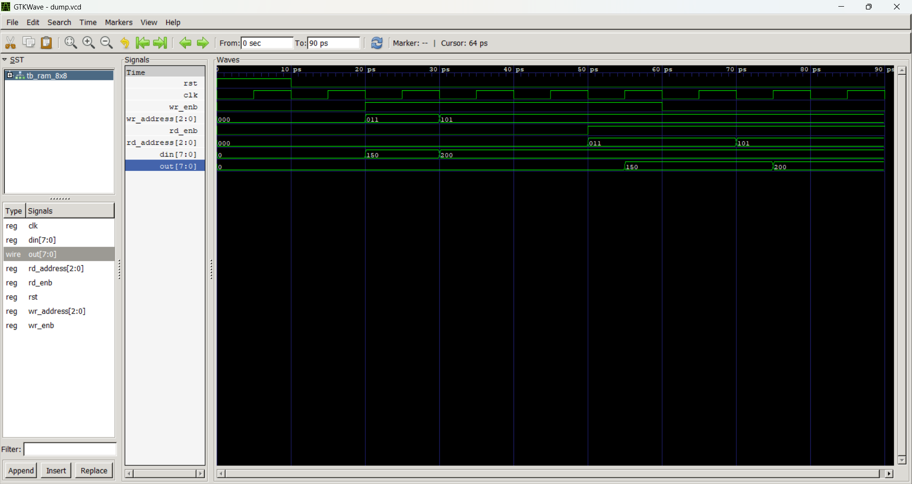

# 8x8 Synchronous RAM — Verilog RTL Design

A fully synchronous **8-location × 8-bit RAM** implemented in synthesisable Verilog RTL, with separate read/write enable signals, active-high synchronous reset, and a complete self-checking testbench verified using GTKWave waveform simulation.

---

## Overview

| Parameter       | Value              |
|----------------|--------------------|
| Memory Depth    | 8 locations        |
| Data Width      | 8 bits             |
| Address Width   | 3 bits (2³ = 8)    |
| Write Port      | Synchronous (clk)  |
| Read Port       | Synchronous (clk)  |
| Reset           | Active-High, Synchronous |
| Language        | Verilog (RTL)      |
| Tool            | Vivado / ModelSim / iVerilog |

---

## Module: `ram_8x8`

### Port Description

| Port         | Direction | Width | Description                        |
|--------------|-----------|-------|------------------------------------|
| `clk`        | Input     | 1     | Clock — all operations on posedge  |
| `rst`        | Input     | 1     | Active-high synchronous reset      |
| `wr_enb`     | Input     | 1     | Write enable                       |
| `rd_enb`     | Input     | 1     | Read enable                        |
| `wr_address` | Input     | 3     | Write address (0–7)                |
| `rd_address` | Input     | 3     | Read address (0–7)                 |
| `din`        | Input     | 8     | Data input (write data)            |
| `out`        | Output    | 8     | Data output (read data)            |

### Internal Structure

```
mem[7:0]  →  8 registers, each 8 bits wide
             (total: 64 bits of storage)
```

### Functional Description

- **Reset:** On `posedge clk` with `rst = 1`, all 8 memory locations are cleared to `0x00` and `out` is set to `0x00`.
- **Write:** On `posedge clk` with `rst = 0` and `wr_enb = 1`, data `din` is written to `mem[wr_address]`.
- **Read:** On `posedge clk` with `rst = 0` and `rd_enb = 1`, data at `mem[rd_address]` is driven onto `out`.
- **Simultaneous Read/Write:** Both `wr_enb` and `rd_enb` can be asserted in the same clock cycle — write and read occur independently to their respective addresses.

---

## RTL Design Notes

- Uses **non-blocking assignments (`<=`)** inside `always @(posedge clk)` blocks — correct synthesisable sequential logic style.
- Separate `always` blocks for read and write paths — clean, readable, and synthesis-friendly.
- The `for` loop in reset is synthesised as parallel register clears (not a sequential loop in hardware).

---

## Testbench: `tb_ram_8x8`

The testbench (`tb_ram_8x8.v`) covers the following scenarios:

| Step | Operation                                | Address | Data      |
|------|------------------------------------------|---------|-----------|
| 1    | Assert reset — clear all locations       | —       | `0x00`    |
| 2    | Write `150` (0x96) to address 3          | `3'd3`  | `8'd150`  |
| 3    | Write `200` (0xC8) to address 5          | `3'd5`  | `8'd200`  |
| 4    | Read address 3 while write still active  | `3'd3`  | —         |
| 5    | Disable write, read address 5            | `3'd5`  | —         |

- Clock period: `10ps` (5ps half-period)
- VCD dump enabled → waveform viewed in **GTKWave**

---

## How to Simulate

### Using iVerilog + GTKWave (free, open-source)

```bash
# Compile
iverilog -o ram_sim tb_ram_8x8.v

# Run simulation
vvp ram_sim

# Open waveform
gtkwave dump.vcd
```

### Using Vivado (Xilinx)

1. Create a new RTL project in Vivado.
2. Add `ram_8x8.v` as a design source.
3. Add `tb_ram_8x8.v` as a simulation source.
4. Run **Behavioral Simulation** → observe waveforms.

---

## Waveform Preview



*Waveform showing reset, write to addr 3 & 5, and sequential read operations.*

---

## File Structure

```
8x8-RAM-verilog/
├── ram_8x8.v          # RTL design — synthesisable 8x8 synchronous RAM
├── tb_ram_8x8.v       # Verilog testbench with write/read/reset scenarios
├── ram_8x8_wave.png   # GTKWave simulation waveform screenshot
└── README.md          # This file
```

---

## Skills Demonstrated

- Synchronous RTL design with proper `always @(posedge clk)` structure
- Non-blocking assignments for synthesisable sequential logic
- Parameterised memory array using `reg [7:0] mem [7:0]`
- Testbench writing: clock generation, reset sequence, stimulus vectors
- VCD waveform dumping and GTKWave analysis

---

## Author

**Badugu Tharaka Ramudu**  
B.Tech ECE — Annamacharya Institute of Technology & Sciences, Hyderabad  
Aspiring VLSI RTL Design Engineer  
📧 tharockbadugu@gmail.com  
🔗 [LinkedIn](https://linkedin.com/in/tharaka-ramudu-badugu)
